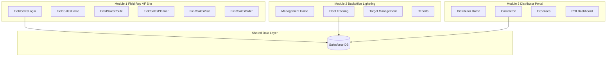
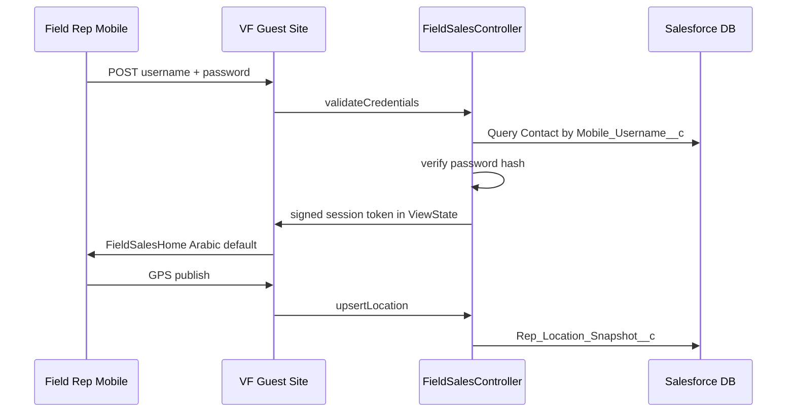

# Architecture — Everbrook / VAMOS Distribution

---

## System overview

Three application modules share one Salesforce org with distributor-scoped data isolation.

---

## Identity and access

| Persona | Identity | Auth | Sees |
|---------|----------|------|------|
| Field rep | Contact | VF username/password (guest site session) | Own routes, visits, orders, targets |
| Everbrook manager | User | Salesforce login | All distributors, all reps |
| Distributor staff | User | Salesforce login | Own distributor only |

### VF session flow

---

## Sharing model

| Record | Field rep | Distributor user | Everbrook |
|--------|-----------|------------------|-----------|
| Sales_Order__c | Own only | `Distributor__c = my account` | All |
| Visit__c | Own only | Via rep's distributor | All |
| Rep_Location_Snapshot__c | Own only | Own distributor's reps | All |
| Distributor_Expense__c | — | Own distributor | All (read) |

**Implementation:** Apex sharing (`without sharing` + explicit WHERE) for guest site; Criteria-based sharing rules or `Distributor__c` on records for Lightning users.

---

## Map stack

| Layer | Technology |
|-------|------------|
| Tiles | OpenStreetMap |
| Library | Leaflet (static resource) |
| Routing | OSRM `router.project-osrm.org` |
| Field site | JS in VF static resources (ported from `plannerMapUtils`) |
| Backoffice | LWC `managementFleetMap`, `fieldRepPlanner` |

---

## KPI calculation

See [KPI_SCORING_MODEL.md](./KPI_SCORING_MODEL.md).

- Batch or real-time rollup on `Rep_Target__c`
- Field rep home displays `Overall_Performance_Score__c` (formula on Contact or cached snapshot)

---

## Integration points (future)

| System | Direction | Data |
|--------|-----------|------|
| ERP (SAP/D365) | Bi-directional | Orders, inventory, invoices |
| E-invoicing (Egypt) | Outbound | Order confirmations |
| Factory (10th of Ramadan) | Inbound | Stock receipts |

---

## Deploy order

1. Objects + fields + record types
2. Map stack (LWCs, CSP, leaflet)
3. Rep_Location_Snapshot + fleet map (Module 2)
4. VF guest site shell (Module 1)
5. Order/visit flows
6. Distributor portal (Module 3)
7. Reports + KPI formulas

See [DEVELOPER_QUICKSTART.md](./DEVELOPER_QUICKSTART.md) for MVP subset.

---

## Pharma component mapping

| Everbrook need | Pharma source folder |
|----------------|---------------------|
| Rep home / today plan | `field-rep-home/` |
| Planner + route | `field-planner/` + `map-stack/` |
| Fleet GPS | `management-fleet-tracking/` |
| Management KPIs | `management-kpi-dashboard/` |
| VF mobile shell | `public-vf-site-pattern/` |
| Visit UI patterns | `visit-management/` |
| Account list/map | `accounts-tab/` |
