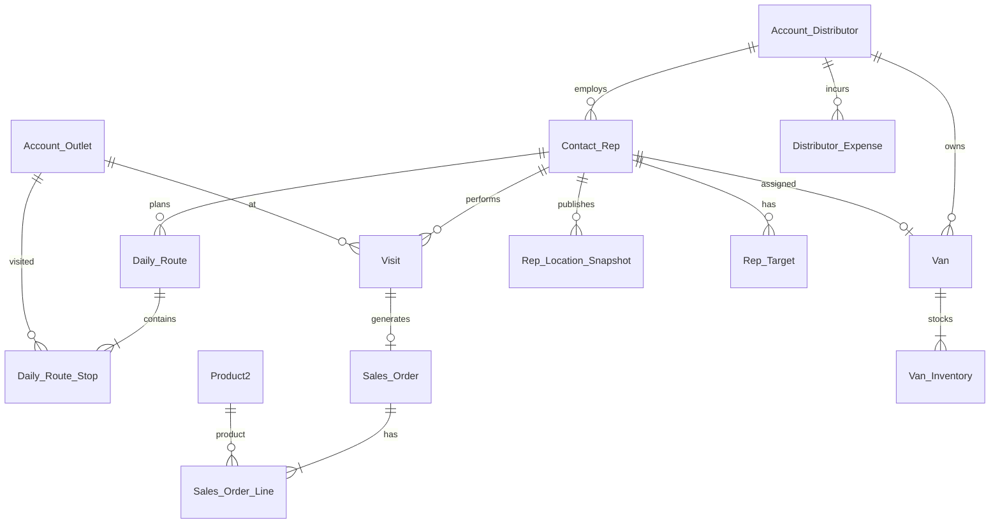

# Data Model — Everbrook / VAMOS Distribution

---

## Entity relationship (summary)

---

## Account record types

| Record Type | API Name | Purpose |
|-------------|----------|---------|
| Distributor | `Distributor` | Juhayna, Vamos owned distribution, future partners |
| Outlet | `Outlet` | Retail customers visited by reps |

### Account fields (key)

| Field | Type | Notes |
|-------|------|-------|
| `GTM_Priority__c` | Checkbox | On priority penetration list |
| `Credit_Limit__c` | Currency | Order blocking |
| `Credit_Hold__c` | Checkbox | Blocks new orders |
| `BillingLatitude` / `BillingLongitude` | Standard | Map pins |

---

## Contact (Field Rep)

| Field | Type | Notes |
|-------|------|-------|
| `RecordType` | Field Rep | |
| `Employer_Distributor__c` | Lookup Account (Distributor) | Required |
| `Mobile_Username__c` | Text, External ID, Unique | VF login |
| `Mobile_Password_Hash__c` | Text(255) | Hashed password |
| `Is_Mobile_Active__c` | Checkbox | Login enabled |
| `Assigned_Van__c` | Lookup Van__c | |
| `Preferred_Language__c` | Picklist: Arabic, English | Default Arabic |
| `Last_Mobile_Login__c` | DateTime | |

---

## Van__c

| Field | Type |
|-------|------|
| `Name` | Auto Number or Text |
| `Distributor__c` | Lookup Account (Distributor) |
| `Assigned_Rep__c` | Lookup Contact |
| `Plate_Number__c` | Text |
| `Is_Active__c` | Checkbox |

---

## Van_Inventory__c

| Field | Type |
|-------|------|
| `Van__c` | Master-Detail Van__c |
| `Product__c` | Lookup Product2 |
| `Quantity__c` | Number |
| `Expiry_Date__c` | Date (optional) |

---

## Daily_Route__c

| Field | Type |
|-------|------|
| `Contact__c` | Lookup Contact (rep) |
| `Route_Date__c` | Date |
| `Distributor__c` | Lookup Account |
| `Status__c` | Picklist: Draft, Active, Completed |
| `Van__c` | Lookup Van__c |

---

## Daily_Route_Stop__c

| Field | Type |
|-------|------|
| `Daily_Route__c` | Master-Detail |
| `Account__c` | Lookup Account (Outlet) |
| `Sequence__c` | Number |
| `Status__c` | Picklist: Pending, Visited, Skipped, Removed |
| `Removal_Reason__c` | Picklist |

---

## Visit__c

| Field | Type |
|-------|------|
| `Contact__c` | Lookup Contact (rep) |
| `Account__c` | Lookup Account (Outlet) |
| `Daily_Route_Stop__c` | Lookup |
| `Planned_Start__c` | DateTime |
| `Actual_Start__c` | DateTime |
| `Actual_End__c` | DateTime |
| `Outcome__c` | Picklist: Sale, No Sale, Return Only, Skipped |
| `No_Sale_Reason__c` | Picklist (required if No Sale/Skipped) |
| `Check_In_Latitude__c` | Number |
| `Check_In_Longitude__c` | Number |
| `Distributor__c` | Lookup Account |

---

## Sales_Order__c

| Field | Type |
|-------|------|
| `Contact__c` | Lookup Contact (rep) |
| `Account__c` | Lookup Account (Outlet) |
| `Visit__c` | Lookup Visit__c |
| `Van__c` | Lookup Van__c |
| `Distributor__c` | Lookup Account |
| `Order_Date__c` | DateTime |
| `Total_Amount__c` | Currency |
| `Status__c` | Picklist: Draft, Submitted, Cancelled |

---

## Sales_Order_Line__c

| Field | Type |
|-------|------|
| `Sales_Order__c` | Master-Detail |
| `Product__c` | Lookup Product2 |
| `Quantity__c` | Number |
| `Unit_Price__c` | Currency |
| `Discount_Pct__c` | Percent |
| `Line_Total__c` | Formula |

---

## Product_Return__c / Product_Return_Line__c

Same pattern as Sales Order — link Visit, Contact, Distributor; return reason per line.

---

## Rep_Location_Snapshot__c

| Field | Type | Pharma source | Everbrook change |
|-------|------|---------------|------------------|
| `Contact__c` | Lookup Contact | `User__c` | **Rename** |
| `Van__c` | Lookup Van__c | — | **Add** |
| `Distributor__c` | Lookup Account | — | **Add** |
| `Latitude__c` | Number | Same | |
| `Longitude__c` | Number | Same | |
| `Recorded_At__c` | DateTime | Same | |
| `Accuracy_Meters__c` | Number | Same | |
| `Is_Sharing__c` | Checkbox | Same | |
| `Source__c` | Text | Same | |

---

## Rep_Target__c

| Field | Type |
|-------|------|
| `Contact__c` | Lookup Contact |
| `Distributor__c` | Lookup Account |
| `Product__c` | Lookup Product2 (optional for visit targets) |
| `Period_Start__c` / `Period_End__c` | Date |
| `Target_Type__c` | Picklist: SKU_Volume, Revenue, Visit_Count |
| `Target_Quantity__c` | Number |
| `Target_Amount__c` | Currency |
| `Actual_Quantity__c` | Number (roll-up) |
| `Actual_Amount__c` | Currency (roll-up) |
| `Capped_Attainment_Pct__c` | Formula — see KPI_SCORING_MODEL.md |

---

## Route_Deviation__c

| Field | Type |
|-------|------|
| `Contact__c` | Lookup |
| `Daily_Route__c` | Lookup |
| `Deviation_Reason__c` | Picklist |
| `Latitude__c` / `Longitude__c` | Number |
| `Recorded_At__c` | DateTime |

---

## Distributor_Expense__c

| Field | Type |
|-------|------|
| `Distributor__c` | Lookup Account |
| `Expense_Date__c` | Date |
| `Category__c` | Picklist: Fuel, Vehicle Maintenance, Warehousing, Labor, Marketing, Other |
| `Amount__c` | Currency |
| `Description__c` | Text Area |
| `Status__c` | Picklist: Draft, Submitted, Approved |

---

## Distributor_Inventory_Log__c

| Field | Type |
|-------|------|
| `Distributor__c` | Lookup |
| `Van__c` | Lookup (optional) |
| `Product__c` | Lookup Product2 |
| `Log_Type__c` | Picklist: Receipt, Load_Out, Load_In, Adjustment, Write_Off |
| `Quantity__c` | Number |
| `Log_Date__c` | DateTime |

---

## Product2 — VAMOS SKUs (seed data)

| SKU Name | Product Code | Notes |
|----------|--------------|-------|
| VAMOS Original | VAMOS-ORG | Bronze can |
| VAMOS Apple | VAMOS-APL | Pink accent |
| VAMOS Citrus | VAMOS-CTR | Green accent |
| VAMOS Mango | VAMOS-MNG | Yellow can |

---

## Case (standard)

| Field | Notes |
|-------|-------|
| `ContactId` | Field rep |
| `AccountId` | Outlet |
| `Type` | Delivery, Product Quality, Equipment, Customer Complaint, Credit, Other |
| Custom: `Visit__c` | Lookup |
| Custom: `Distributor__c` | Lookup |

---

## Picklists (Arabic + English translations required)

| Picklist | Values |
|----------|--------|
| `No_Sale_Reason__c` | Shop closed, Owner absent, Sufficient stock, Price objection, Credit issue, Competitor promo, Other |
| `Route_Deviation_Reason__c` | Traffic, Customer request, Breakdown, Personal break, Wrong turn, Emergency, Other |
| `Return_Reason__c` | Damaged, Expired, Overstock, Quality, Wrong delivery, Other |
| `Visit.Outcome__c` | Sale, No Sale, Return Only, Skipped |
