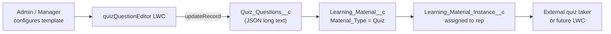

# Quiz Question Editor — Reusable LWC Module

A Google Forms–style Lightning Web Component for configuring quiz and assessment questions as JSON. Designed for **LMS learning materials** today and reusable for **pharma field coaching templates** (manager ↔ sales rep coaching events).

---

## What's in this folder

```
modules/quiz-question-editor/
├── README.md                          ← You are here
├── deploy.sh                          ← One-command deploy to any org
├── lwc/
│   └── quizQuestionEditor/            ← Self-contained LWC bundle (copy into force-app or deploy directly)
│       ├── quizQuestionEditor.js
│       ├── quizQuestionEditor.html
│       ├── quizQuestionEditor.css
│       └── quizQuestionEditor.js-meta.xml
└── examples/
    ├── pharma-coaching-template.json  ← Sample coaching assessment (knowledge + manager scales)
    └── (see repo root example-english-exam.json for a full LMS exam)
```

The **source of truth** in this repo also lives at:

`force-app/main/default/lwc/quizQuestionEditor/`

Keep both in sync when you change the component.

---

## How it works

### High-level flow



1. An admin opens a **Learning Material** record with `Material_Type__c = Quiz`.
2. The **Quiz Question Editor** LWC loads existing JSON from `Quiz_Questions__c`.
3. The admin builds questions visually (or edits raw JSON).
4. **Save** writes the JSON blob back via Lightning Data Service (`updateRecord`) — no custom Apex required.
5. A **Learning Material Instance** (or coaching event record) links a rep to the template; a separate consumer renders and scores the quiz.

### UI modes

| Mode | Description |
|------|-------------|
| **Visual editor** (default) | Google Forms–like cards: question text, type picker, options/scales, live preview |
| **JSON editor** | Toggle via **Edit JSON** in the header; bidirectional sync with the visual editor |

### Question types

| Type | `type` value | Grading |
|------|--------------|---------|
| **Single choice** | `single-choice` | One correct option (`correctAnswer` = 0-based index) |
| **Multiple choice** | `multiple-choice` | One or more correct options (`correctAnswers` = index array) |
| **Scale** | `scale` | Each scale value has a **weight** (absolute points awarded when selected) |

Scale questions are ideal for **manager observations** and **self-assessments** in coaching — not just right/wrong knowledge checks.

---

## JSON schema (v1.1)

Stored in `Learning_Material__c.Quiz_Questions__c` (Long Text Area, 32,768 chars).

### Root object

```json
{
  "version": "1.1",
  "totalQuestions": 6,
  "totalPoints": 40,
  "questions": [ /* ... */ ]
}
```

- `totalQuestions` / `totalPoints` are **auto-calculated** on save.
- `totalPoints` = sum of each question's max achievable score (for scale: `max(scalePoints[].weight)`).

### Single choice

```json
{
  "id": "q1",
  "question": "What is the approved indication?",
  "type": "single-choice",
  "options": ["Option A", "Option B", "Option C"],
  "correctAnswer": 1,
  "points": 5,
  "explanation": "Shown after answering (optional)"
}
```

### Multiple choice

```json
{
  "id": "q2",
  "type": "multiple-choice",
  "options": ["Message A", "Message B", "Message C"],
  "correctAnswers": [0, 2],
  "points": 10
}
```

### Scale (weighted)

```json
{
  "id": "q3",
  "question": "Rate call opening technique",
  "type": "scale",
  "scaleMin": 1,
  "scaleMax": 5,
  "scaleMinLabel": "Needs improvement",
  "scaleMaxLabel": "Exceptional",
  "scalePoints": [
    { "value": 1, "weight": 0 },
    { "value": 2, "weight": 2 },
    { "value": 3, "weight": 5 },
    { "value": 4, "weight": 8 },
    { "value": 5, "weight": 10 }
  ],
  "points": 10
}
```

**Scoring rule for consumers:** when the learner/manager selects value `N`, look up `scalePoints` where `value === N` and award that `weight` as the question score.

---

## Pharma coaching reuse

### Recommended data model mapping

| Concept | Current object (Cloudastick LMS) | Pharma coaching equivalent |
|---------|----------------------------------|----------------------------|
| **Template** | `Learning_Material__c` (Quiz) | `Coaching_Template__c` or `Learning_Material__c` |
| **Question JSON** | `Quiz_Questions__c` | Same field name on template object |
| **Coaching event** | `Learning_Material_Instance__c` | `Coaching_Event__c` assigned to rep + manager |
| **Score** | `Learning_Material_Instance__c.Score__c` | `Coaching_Event__c.Score__c` |

### Typical coaching template mix

| Question type | Coaching use |
|---------------|--------------|
| **Single / multiple choice** | Product knowledge, compliance, messaging accuracy |
| **Scale (manager)** | Manager rates rep behavior observed in the field (opening, objection handling, closing) |
| **Scale (self)** | Rep self-assessment before manager debrief |

See [`examples/pharma-coaching-template.json`](examples/pharma-coaching-template.json) for a ready-to-paste template.

### Aligning templates to users (coaching events)

1. **Create template** — `Learning_Material__c` with `Material_Type__c = Quiz`; configure questions in this LWC.
2. **Assign to rep** — create `Learning_Material_Instance__c` (or `Coaching_Event__c`) linking:
   - Template / material
   - **Rep** (Contact or User lookup)
   - **Manager** (for scale questions completed during debrief)
   - Status: `Not Started` → `In Progress` → `Completed`
3. **Run coaching** — manager and rep complete the assessment; consumer stores answers and computes score from JSON weights.
4. **Review** — manager sees scale + knowledge scores on the coaching event record.

To port to a **pharma org** with a different object:

1. Add a Long Text Area field (e.g. `Assessment_Questions__c`) with the same JSON shape.
2. Update imports in `quizQuestionEditor.js`:

```javascript
import QUIZ_QUESTIONS_FIELD from '@salesforce/schema/Coaching_Template__c.Assessment_Questions__c';
import MATERIAL_TYPE_FIELD from '@salesforce/schema/Coaching_Template__c.Template_Type__c';
```

3. Update `quizQuestionEditor.js-meta.xml` `<objects>` to your template object.
4. Adjust the `Material_Type__c !== 'Quiz'` guard to your picklist value (e.g. `Field Coaching`).

---

## Salesforce dependencies

### Required fields (on host object)

| Field | Type | Purpose |
|-------|------|---------|
| `Quiz_Questions__c` | Long Text Area (32,768) | Stores the JSON blob |
| `Material_Type__c` | Picklist | Must include `Quiz`; LWC only activates for that value |

### Recommended quiz fields (template record)

| Field | Purpose |
|-------|---------|
| `Quiz_Time_Limit_Minutes__c` | Time limit (validated when type = Quiz) |
| `Passing_Score__c` | Pass threshold % (0–100) |
| `Max_Attempts__c` | Attempt limit |
| `Randomize_Questions__c` | Shuffle flag for consumer |
| `Show_Results__c` | Show results after completion |

### Instance / event tracking

| Object | Fields |
|--------|--------|
| `Learning_Material_Instance__c` | `Score__c`, `Attempt_Number__c`, `Status__c`, `Started_On__c`, `Completed_On__c` |

Deploy field metadata from `force-app/main/default/objects/Learning_Material__c/` if the target org does not have them.

---

## Deployment

### Option A — deploy script (this module)

```bash
cd modules/quiz-question-editor
chmod +x deploy.sh
./deploy.sh pharma-prod
```

### Option B — Salesforce CLI

```bash
sf project deploy start \
  --source-dir modules/quiz-question-editor/lwc/quizQuestionEditor \
  -o your-org-alias \
  --wait 10
```

### Option C — copy into SFDX project

```bash
cp -R modules/quiz-question-editor/lwc/quizQuestionEditor \
  force-app/main/default/lwc/
```

Then deploy `force-app` as usual.

### After deploy

1. Open **Lightning App Builder** on the template record page (`Learning_Material__c` or your coaching template object).
2. Drag **Quiz Question Editor** onto the page.
3. Save and activate.

---

## Component API

| Property | Description |
|----------|-------------|
| `recordId` | Auto-injected on record pages; ID of the host template record |

### Permissions

Users need **read/edit** on `Quiz_Questions__c` and the host object. The `LMS` permission set in this repo grants access.

---

## External quiz consumer contract

If the quiz is rendered outside Salesforce (e.g. `cloudastick.org/learn`) or in a future LWC:

1. Read `Quiz_Questions__c` JSON from the assigned instance's parent material.
2. Render by `type`:
   - `single-choice` → radio group
   - `multiple-choice` → checkboxes
   - `scale` → linear scale from `scaleMin` to `scaleMax` with endpoint labels
3. On submit:
   - **Choice:** award `points` if answer matches `correctAnswer` / `correctAnswers`
   - **Scale:** award `scalePoints[n].weight` for the selected value
4. Sum question scores; compare to `Passing_Score__c` on the template.

---

## Validation rules (on save in LWC)

| Type | Rules |
|------|-------|
| All | `id` and `question` text required |
| Single choice | ≥ 2 non-empty options; one correct answer selected |
| Multiple choice | ≥ 2 non-empty options; ≥ 1 correct answer |
| Scale | `scaleMin < scaleMax`; 2–10 points; each weight between 0 and `points` |

---

## Syncing changes

When you edit the component in `force-app/main/default/lwc/quizQuestionEditor/`, copy updates back to this module:

```bash
cp force-app/main/default/lwc/quizQuestionEditor/* \
   modules/quiz-question-editor/lwc/quizQuestionEditor/
```

---

## Related files in this repo

| Path | Description |
|------|-------------|
| `force-app/main/default/lwc/quizQuestionEditor/` | Deployed LWC source |
| `force-app/main/default/objects/Learning_Material__c/` | Object + quiz fields |
| `force-app/main/default/objects/Learning_Material_Instance__c/` | Per-user assignment / attempts |
| `example-english-exam.json` | Full LMS exam sample |
| `deploy-quiz-system.sh` | Full quiz system deploy (fields, validation, permissions) |
