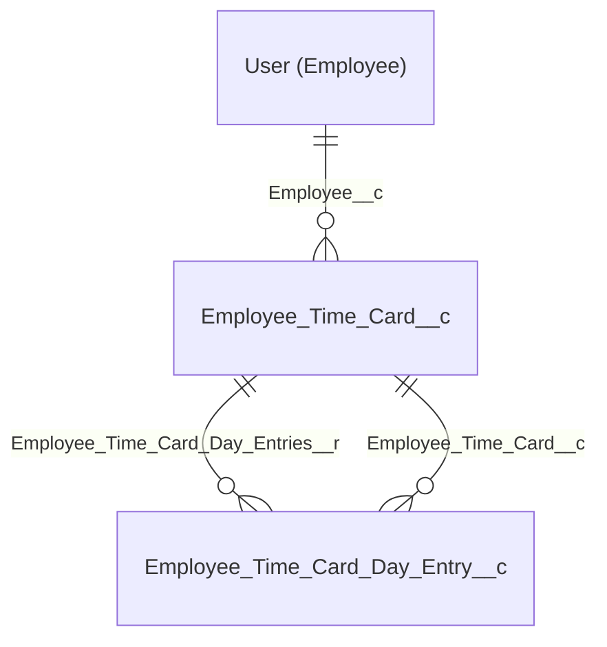

# Employee Time Card & Working Days Analysis – Concept for Reuse

This document describes the **Employee Time Card** and **Working Days Analysis** design so it can be reused in other verticals and environments with different architecture or business rules. All related metadata has been retrieved into this project; sample records are in `docs/sample-data/`.

---

## 1. Purpose

The solution provides:

- **Monthly time cards per employee** – One parent record per employee per month (e.g. February 2026) with hierarchy (Country, Team, Territory, Employee).
- **Day-level entries** – One child record per calendar day per time card, with:
  - **Calendar working days** – Whether the day counts as a working day.
  - **Days with activities** – Days where the employee logged calls, meetings, or other activities.
  - **No-activity days** – Working days with no recorded activity (often highlighted in red/orange in reports).
  - **TOT (Time Off Territory) days** – Leave, holidays, or other non-working time.
  - **Submitted calls / remote calls / completed meetings** – Activity counts used for “visits per day” and similar metrics.
- **Working Days Analysis report** – A matrix/tabular report grouping by Country | Team | Territory | Employee, with columns for the metrics above and optional formulas (e.g. % days with activities, visits per day, coverage %). Summary information is calculated from the full dataset even when the UI shows a maximum of 2,000 rows.

---

## 2. Data model

### 2.1 Entity relationship

- **Employee_Time_Card__c** – One record per employee per month. Key fields:
  - `Employee__c` (Lookup to User)
  - `Territory__c` (Text or lookup, from Territory2/OCE)
  - `Country__c` (Text, e.g. SA, AE)
  - `Time_Card_Month_Start_Date__c`, `Time_Card_Month_End_Date__c`
  - `Employee_Manager__c`, `Employee_Profile__c`
  - `Country_Team_Territory_Employee__c` – Formula/rollup for report grouping (Country | Team | Territory | Employee)
  - `Hierarchical_View__c`, `of_Targeted_Customers__c`, `of_Target_Visits_for_Trg_Customers__c`, `Unvisited_Trg_Customers__c` (for coverage/achievement metrics)

- **Employee_Time_Card_Day_Entry__c** – One record per day per time card. Key fields:
  - `Employee_Time_Card__c` (Master-Detail or Lookup to Employee_Time_Card__c)
  - `Date__c` – The calendar date
  - `Day_Definition__c` – e.g. "Weekend Day", "Working Day"
  - `Calendar_Working_Days__c` – 1 if working day, 0 otherwise
  - `Days_with_Activities__c`, `No_Activity_Days__c`
  - `Completed_Meetings__c`, `Submitted_Calls__c`, `Submitted_Remote_Calls__c`, `Submitted_Calls_for_Targeted_Customers__c`
  - `TOT_Days__c`, `TOT_Days_Exluding_weekends__c`, `Holiday_Days__c`

Name formats in this org: **Employee Time Card** = `ETC-{0000000}`, **Employee Time Card Day Entry** = `ETCEntry-{00000}`.

---

## 3. Reports

### 3.1 Working Days Analysis V 2.0

- **Folder:** OCE Call Reports & TOT  
- **Report API name:** `Working_Days_Analysis_V2_iBZ` (path: `OCECallReportsTOT/Working_Days_Analysis_V2_iBZ.report-meta.xml`)
- **Report type:** Custom report type on `Employee_Time_Card_Day_Entry__c` with parent `Employee_Time_Card__c`  
  (`CustomEntity$Employee_Time_Card_Day_Entry__c@Employee_Time_Card_Day_Entry__c.Employee_Time_Card__c`)
- **Format:** Matrix
- **Grouping:**
  - **Across:** `Time_Card_Month_Start_Date__c` (Month)
  - **Down:** `Country_Team_Territory_Employee__c` (Country | Team | Territory | Employee hierarchy)
- **Filters (examples):** Hierarchical View = 1, Country not equal to blank, Territory not equal to blank, Employee Profile does not contain "manager". Date filter: `Employee_Time_Card_Day_Entry__c.Date__c` (e.g. This Month).
- **Columns (summarized):** Date, Day Definition, Holiday Days, Employee Profile; **Sum** of Calendar Working Days, Days with Activities, Completed Meetings, No Activity Days, TOT Days (excluding weekends), Submitted Calls, Submitted Remote Calls, Targeted Customers, Submitted Calls for Targeted Customers, Target Visits, Unvisited Target Customers.
- **Formulas:** % Days With Activities/Calendar Wrk Days, Visits Per Day, % Visits Achievement vs Target, Coverage %.
- **Conditional formatting:** No Activity Days (e.g. green 0, orange 1, red &gt;1).

The UI may show “This report has more results than we can show (up to 2,000 rows). Summary information is calculated from full report results.”

### 3.2 New Working days analysis Report Month

- **Folder:** Working Days Analysis V 2.0  
- **Path:** `WorkingDaysAnalysis/New_Working_days_analysis_Report_Month_4Tu.report-meta.xml`  
- Same concept, variant by month; details are in the retrieved report metadata.

---

## 4. Flows

Flows that create, update, or read time card and working-days data:

| Flow | Role |
|------|------|
| **Employee_time_tracking_Monthly_Time_Card_Creation** | Creates `Employee_Time_Card__c` for the current user (and territory from User Territory Assignment). Creates **Employee_Time_Card_Day_Entry__c** for each day in the month (using weekend definition from `Weekend_Definition__c` or similar). Trigger: likely record-triggered or scheduled. |
| **Employee_time_tracking_Activity_Counts** | Updates day-entry activity counts (e.g. submitted calls, meetings, remote). Uses time zone from `Employee_Time_Card__r.CreatedBy.TimeZoneSidKey` or `Employee_Time_Card__r.Employee__r.TimeZoneSidKey` for date logic. Writes to `Employee_Time_Card_Day_Entry__c`. |
| **Run_for_updating_real_working_days** | Updates **Real_Working_Days__c** on related Call, Meeting, and Time Off Territory records. Branches on activity type (Call, Meeting, TOT) and copies `Real_Working_Days__c` from the related record into the activity. Used to keep working-day alignment consistent. |
| **Activity_Activity_Update** | References `Real_Working_Days__c` on Meeting, Call, and Time_Off_Territory for activity rollups. |
| **Call_Activity_Clone**, **Meeting_Activity_Clone**, **TOT_Activity_Clone** | Clone activities and set `Real_Working_Days__c` from the source record; feed into time card / working-days logic. |

End-to-end flow:

1. **Monthly time card creation** → One `Employee_Time_Card__c` per user per month and many `Employee_Time_Card_Day_Entry__c` (one per day).
2. **Activity logging** (Calls, Meetings, TOT) → Flows update day entries (activity counts) and/or **Real_Working_Days__c** on activities.
3. **Run_for_updating_real_working_days** → Keeps Real Working Days in sync across activities.
4. **Reports** → Read from time card and day entries; no direct flow for report generation.

---

## 5. Reuse in other verticals and environments

### 5.1 What stays generic

- **One parent time card per employee per month** – Same idea in any org.
- **One day entry per calendar day per time card** – Same granularity.
- **Metrics:** Working days, days with activities, no-activity days, TOT, and activity counts (calls, meetings, remote).
- **Report pattern:** Matrix/summary by hierarchy (e.g. Country | Team | Territory | Employee) and by month.

### 5.2 What to adapt

| Aspect | In this org | For reuse |
|--------|-------------|-----------|
| **Object/field labels and API names** | `Employee_Time_Card__c`, `Employee_Time_Card_Day_Entry__c`, `Employee__c`, `Territory__c`, `Country__c` | Keep or rename (e.g. `Rep_Time_Card__c`) and align all flows/reports. |
| **Hierarchy** | Country, Team, Territory, Employee (from User + Territory2) | Replace with your org’s hierarchy (Region, District, Rep; or Brand, Team, Rep). Update formula `Country_Team_Territory_Employee__c` and report grouping. |
| **Working-day rules** | Weekend definition (e.g. `Weekend_Definition__c`), holidays | Use your calendar and holiday table; same idea, different data source. |
| **Activity types** | Call, Meeting, TOT (Time Off Territory), Remote | Map to your activity objects and fields; keep “days with activities” vs “no activity” logic. |
| **TOT definition** | OCE Time Off Territory (e.g. `OCE__TimeOffTerritory__c`) and related `Real_Working_Days__c` | Use your leave/TOT object and working-days field. |
| **Report folder and name** | OCE Call Reports & TOT, Working Days Analysis V 2.0 | Create folders and report names per your security and naming standards. |
| **Timezone logic** | Middle East / Africa time zones in formulas | Replace with your regions’ time zones in **Employee_time_tracking_Activity_Counts** (and any other flow that uses time zone). |

### 5.3 Dependencies to carry or replace

- **User** – Employee is User in this org; no custom Employee object.
- **Territory** – From Territory Management (Territory2) or OCE; Territory name stored on the time card.
- **Weekend_Definition__c** – Custom object used to know which weekdays are weekends; replicate or replace with shared calendar/holiday logic.
- **OCE / Call / Meeting / Time Off Territory** – Activity and TOT objects are OCE-specific; in another org use your equivalent objects and link them to the day entry or time card (e.g. via Real_Working_Days or a shared date field).

---

## 6. Sample data

Example records are under **docs/sample-data/**:

- **Employee_Time_Card.csv** – Sample `Employee_Time_Card__c` rows (Id, Name, Employee, Territory, Country, month dates, Manager).
- **Employee_Time_Card_Day_Entry.csv** – Sample `Employee_Time_Card_Day_Entry__c` rows (Date, Day Definition, working days, activities, TOT).

See **docs/sample-data/README.md** for a short description of each file. Use these as a reference for field usage and relationships; replace IDs and user references when testing in another org.

---

## 7. References (retrieved metadata)

| Component | Path in repo |
|-----------|-------------------------------|
| Custom objects | `force-app/main/default/objects/Employee_Time_Card__c/`, `force-app/main/default/objects/Employee_Time_Card_Day_Entry__c/` |
| Fields | `.../objects/.../fields/*.field-meta.xml` |
| Flows | `force-app/main/default/flows/` – see table in section 4 for time-card-related flow names |
| Reports | `force-app/main/default/reports/OCECallReportsTOT/Working_Days_Analysis_V2_iBZ.report-meta.xml`, `force-app/main/default/reports/WorkingDaysAnalysis/New_Working_days_analysis_Report_Month_4Tu.report-meta.xml` |
| Retrieve manifest | `manifest/package-timecard-retrieve.xml` – use for `sf project retrieve start --manifest manifest/package-timecard-retrieve.xml` in an org that has these components. |

---

*Document generated for the SAJA project; metadata retrieved from target org (SAJAProd).*
