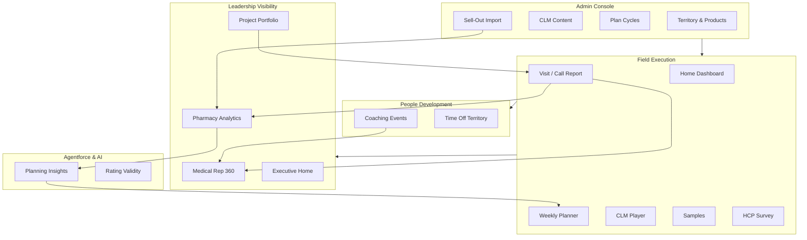

# Zeta Pharma Commercial Platform
## Complete Sales Enablement Guide — Every Module, Every Capability

**Audience:** Sales professionals, commercial leaders, and customer-facing teams  
**Purpose:** Educate you on what is built, why it matters for pharma, and how to position Salesforce as the platform of choice  
**Version:** June 2026

---

## How to Use This Guide

This document is organized as **one deep chapter per business module**. Each chapter answers four questions a salesperson must be able to answer in a customer meeting:

1. **What business problem does this solve?**
2. **Who uses it and when in their day?**
3. **What can they actually do — in plain language?**
4. **Why is Salesforce better than spreadsheets, point solutions, or legacy CRM?**

Read the opening chapters first for platform context. Then dive into any module chapter before a demo or RFP response.

---

# Part 0 — Platform Foundation

## Why Salesforce Is Powerful for Any Pharmaceutical Company

Pharma commercial operations are uniquely complex. A single field rep touches **HCPs, pharmacies, hospitals, wholesalers, marketing-approved content, sample compliance, medical affairs, and territory targets** — often in one morning. Legacy tools force teams to stitch together spreadsheets, email, paper call notes, separate CLM apps, and monthly PowerPoint decks from headquarters.

**Salesforce solves this by putting the entire commercial loop on one platform:**

| Pharma Challenge | How Salesforce Wins |
|------------------|---------------------|
| **Regulated customer engagement** | Every visit, sample, presentation, and inquiry is a structured record with audit trail, ownership, and sharing rules — not a lost notebook entry |
| **Territory complexity** | Enterprise Territory Management + custom alignment objects (ATF/ATPF/PTA) mirror OCE/Veeva targeting without a separate database |
| **Mobile field force** | Lightning + Visualforce mobile pages work in Salesforce One — reps complete call reports on the phone between customers |
| **Approved content (CLM)** | Presentations live in Salesforce Files with territory targeting, dwell-time logging, and message feedback tied to the visit |
| **Sample compliance** | Inventory, lot numbers, expiry, and deduction on visit completion — automatic audit trail |
| **Sell-out to sell-in connection** | Wholesaler CSV data, pharmacy bricks, affiliations, and visit planning in one org — connect market data to field action |
| **Leadership visibility** | Dashboards roll up from the same visit records reps create — no lag, no manual consolidation |
| **AI on your data** | Agentforce and Einstein prompts run on *your* visits, ratings, and pharmacy withdrawals — not generic chatbot answers |
| **Configurable without code** | Admins use the Admin Console for territories, CLM, coaching templates, plan cycles — commercial ops change every cycle without IT deployments |
| **Extensible platform** | Mendix, OneKey, IMS, SAP, Outlook connectors scaffolded; new modules deploy as packages |

**The Zeta Pharma implementation demonstrates the full commercial stack** — from a rep's Monday morning planner through C-level project portfolios — on standard Salesforce objects (Account, Product, Case, Task, Event, Territory2) extended with pharma-specific modules. This is not a slide-deck promise; it is implemented metadata in this org.

### Three Lightning Apps — Three Personas

| App | Who | Primary Job |
|-----|-----|-------------|
| **Pharma Field** | Medical reps, MSLs | Plan, visit, report, present, sample |
| **Pharma Management** | District managers, SFE, regional managers | Coach, approve, monitor KPIs, run reports |
| **Pharma Executive** | C-level, BU heads | Portfolio view, budgets, workforce, projects |

### Business Units

The platform supports multi-BU pharma structures: **GIT, Diabetes, Cluster, CHC** — used across projects, budgets, KPIs, and executive rollups.

### Product Catalog

Zeta Pharma portfolio (e.g. Empacoza diabetes line) is seeded from a structured catalog with therapy areas, product families, and images — aligned to territory product assignments.

---

# Chapter 1 — Account Foundation (Pharma Record Types)

## The Business Problem

Pharma field teams do not sell to "accounts" generically. They sell to **HCPs, pharmacies, hospitals, and business contacts** — each with different data, compliance needs, and engagement patterns. A one-size-fits-all CRM account record creates confusion, bad data, and failed audits.

## Who Uses It

- **Field reps** — look up the right customer type before every visit
- **Data stewards** — maintain specialty, license, tier, and status
- **MSLs** — focus on HCP and institution profiles
- **Managers** — segment teams by account type in reports

## What You Can Do

### Four Purpose-Built Record Types

| Record Type | Customer Type | Key Business Data |
|-------------|---------------|-------------------|
| **Medical Professional (HCP)** | Prescribing doctors | Up to 4 medical specialties, designation, license, tier, classification |
| **Pharmacy** | Retail/outlet accounts | Pharmacy type, license, status, brick membership |
| **Institution (HCO)** | Hospitals, clinics | Institution type, status |
| **Business Contact (BC)** | Non-prescribing influencers | Professional title, department, status |

### HCP Specialty Depth

46 medical specialty values in a global picklist — HCP accounts support **Specialty 1 through Specialty 4** for multi-specialty physicians (e.g. cardiologist who also practices internal medicine).

### Dedicated Experiences Per Type

Each record type has its own page layout and Lightning record page — reps see only relevant fields. No clutter from hospital fields on a pharmacy record.

### Egyptian Localization

Account defaults and localization support the Egypt market context (governorate, local identifiers).

## Why Salesforce Wins Here

- **Person Accounts** for HCP/BC — industry-standard model used by Veeva and IQVIA OCE
- **Record types** let marketing, medical, and sales share one Account object with governed data models
- **Extensible** — add fields, validation rules, and AI rating checks without changing the core object
- **Affiliations, visits, samples, CLM** all hang off the same Account — true 360° view

## Talk Track for Sales

*"Your reps won't wade through irrelevant fields. An HCP looks like an HCP. A pharmacy looks like a pharmacy. And every visit, sample, and presentation ever delivered to that customer is on the same record — searchable, reportable, and territory-scoped."*

---

# Chapter 2 — Territory Alignment & Targeting

## The Business Problem

Not every doctor in a territory deserves the same visit frequency. Not every product is promoted in every region. Pharma companies spend millions on field force — **misaligned targeting wastes visits on low-potential accounts while high-value HCPs are under-called**.

## Who Uses It

- **SFE / sales operations** — set potential, penetration, and product matrices
- **District managers** — review classification distribution across the team
- **Field reps** — see only products and targets aligned to their territory
- **Home dashboard & planner** — next-best-customer ranking uses classification data

## What You Can Do

### Account Territory Fields (ATF) — Who Matters

For each Account × Territory combination:

- **Potential** — A, B, or C (prescribing/decision influence)
- **Penetration** — 1, 2, or 3 (current share of wallet / adoption depth)
- **Classification** — auto-derived matrix: A1, A2, A3, B1, B2, B3, C1, C2, C3

Example: An **A1** doctor is high potential with shallow penetration — prime for intensive calling. A **C3** account may need maintenance frequency only.

### Account Territory Product Fields (ATPF) — What to Detail

For each Account × Territory × Product:

- **Rx per week** — prescribing volume indicator
- **Adoption** — High / Medium / Low
- **Loyalty** — High / Medium / Low
- **Product matrix rating** — nine combinations (HH through LL)
- **Target visit frequency** — Weekly, Bi-Weekly, Monthly, Quarterly, As Needed

### Product Territory Alignment (PTA) — What Reps Can Sell

Defines which products are active in which territories, with effective start/end dates. Visit call reports and CLM libraries filter to **only aligned products** — compliance by design.

### Admin Console: Territory & Product Managers

- **Territory Management Console** — product lines, territory tree (Line → District → MR), user assignment
- **Product Territory Manager** — catalog tree → assign products to territory hierarchies
- **Bricks Management** — IQVIA IMS-style geographic bricks linked to territories

## Why Salesforce Wins Here

- **Mirrors OCE/Veeva data model** — customers migrating from IQVIA recognize ATF/ATPF/PTA immediately
- **Flows auto-calculate** classification and unique keys — no spreadsheet maintenance
- **Territory2 native** — sharing, assignment, and hierarchy reports out of the box
- **Downstream integration** — coverage %, RF%, next-best customer, and visit product lists all read the same alignment data

## Talk Track for Sales

*"Your targeting model isn't locked in a spreadsheet that goes stale on day one. Potential, penetration, and product adoption live in Salesforce, drive the rep's daily priorities, and feed management dashboards — one source of truth from strategy to execution."*

---

# Chapter 3 — Field Rep Home Dashboard

## The Business Problem

Reps start their day asking: *How am I doing? Where am I going? Who should I call that I'm missing?* Without a single landing page, they open five reports, call their manager, or guess — losing selling time before the first visit.

## Who Uses It

- **Medical representatives** — every morning, mobile and desktop
- **District managers** — quick view when coaching (territory-scoped KPIs)

## What You Can Do

### Performance at a Glance (`fieldRepHomeMetrics`)

- **Visit coverage %** — achieved visits vs plan targets for the current cycle
- **Drill-down table** — see every account with potential, penetration, classification, planned vs actual visits
- **RF% by classification** — call frequency attainment for A, B, and C segments separately
- **LF% / MF% context** — understand low-frequency and missed-frequency accounts

### Today's Plan (`fieldRepHomeTodayPlan`)

- **Up Next** — ordered list of today's scheduled visits
- **Interactive map** — OpenStreetMap with geocoded stops
- **Route context** — drive-time awareness for the day
- **Optimization ideas** — suggestions to improve daily coverage based on geography and gaps

### Next Best Customer (`fieldRepHomeNextBestCustomer`)

- **Top 5 ranked accounts** — who to call next based on targeting gaps
- **One-click draft visit** — create a planned visit without opening the planner
- **Agentforce scoring** — AI-enhanced prioritization on the Accounts tab

### Gamification Elements

Activity streaks, milestone badges, and district leaderboard rankings drive healthy competition without separate gamification software.

## Why Salesforce Wins Here

- **Live data** — KPIs update when visits are completed, not when someone runs a monthly report
- **Territory-scoped** — each rep sees only their numbers; managers see rollups
- **Mobile-first** — same home page in Salesforce mobile app
- **Agentforce ready** — invocable actions provide AI briefs for home, planner, and account contexts

## Talk Track for Sales

*"Imagine your rep opening their phone at 7 AM and knowing exactly where they stand against plan, what's on today's route, and which five doctors they're under-calling. That's not a BI project — it's their Salesforce home page."*

---

# Chapter 4 — Field Rep Planner (Calendar & Map)

## The Business Problem

Weekly visit planning in pharma is still often done in Outlook, WhatsApp groups, or paper diaries. Managers cannot see the plan. Routes are inefficient. Time off conflicts with customer appointments. **Unplanned weeks produce unplanned results.**

## Who Uses It

- **Medical reps** — plan the week every Sunday/Monday
- **District managers** — review rep calendars during coaching (manager view)
- **SFE** — compare planned vs actual when analyzing coverage gaps

## What You Can Do

### Weekly Calendar (`fieldRepPlanner`)

- **Mon–Sun view** with 30-minute slots from 6:00 AM to midnight
- **Drag-and-drop scheduling** — pull an HCP, pharmacy, or institution from the sidebar onto a time slot → instant draft `Visit__c`
- **Reschedule** — drag visit blocks to new days/times
- **Resize** — drag bottom handle to change visit duration
- **Status awareness** — completed visits cannot be moved (compliance)

### Account Sidebar (`plannerAccountCollections`)

- Filter territory accounts by record type, specialty, classification, brick
- Search by name
- Organized lists for fast drag sources

### Time Off Territory Integration

- Drag **TOT block** from palette onto calendar
- Opens time-off request (draft or submit)
- Approved TOT appears alongside visits — managers see capacity impact

### Map & Route View

- **OpenStreetMap + Leaflet** — geocoded visit pins per day
- **OSRM routing** — driving route across ordered stops with distance and duration
- **Route optimization** — apply optimized stop order back to calendar times
- **Neighbouring pharmacies** — discover nearby outlets for joint calling

## Why Salesforce Wins Here

- **Visits are CRM records** — not calendar entries that never become call reports
- **Plan connects to actuals** — completed visits update time card metrics automatically
- **No separate routing license** — OSRM integration built into the planner
- **Same data model as OCE/Veeva** — drag-to-plan is the industry UX standard

## Talk Track for Sales

*"Planning isn't a separate app. The rep drags Dr. Hassan onto Tuesday at 10 AM, drives the optimized route Wednesday morning, and completes the call report on the same visit record. Plan, route, execute, measure — one platform."*

---

# Chapter 5 — Visit & Call Reporting

## The Business Problem

If it isn't logged, it didn't happen — for compliance, for management, for marketing ROI, and for the rep's own performance review. Paper call notes, delayed CRM entry, and incomplete product messaging data are the #1 field force data quality problem in pharma.

## Who Uses It

- **Medical reps** — during or immediately after every customer interaction
- **Compliance / audit** — review completed visit records
- **Marketing** — analyze products discussed and message sentiment
- **Medical affairs** — trace inquiries back to visits

## What You Can Do

### Structured Call Report (`visitCallShell` — Desktop)

Left-navigation sections:

1. **Details** — account, date/time, visit type, objectives, status, double-visit flag, project link
2. **Attendees** — primary HCP plus affiliated contacts via search and affiliation discovery
3. **Products** — territory-aligned products only; per-product detail type and notes
4. **Product Messages** — topic-level sentiment (Positive / Neutral / Negative) per product
5. **Samples** — lot-tracked distribution from rep inventory
6. **Presentations** — CLM sessions launched from the visit
7. **Affiliations** — relationship network for the visited account

### Mobile Call Report (`VisitCallReport` Visualforce)

- Salesforce One optimized
- Same sections and save logic as desktop
- For reps completing reports on phone between calls

### Visit Lifecycle

| Status | Meaning |
|--------|---------|
| **Draft** | Planned or in progress — editable |
| **In Progress** | Active visit |
| **Completed** | Submitted — **read-only**; triggers time card update and sample deduction |

### Quick Actions from Visit Header

- Jump to account profile
- **Start coaching evaluation** (double visit)
- **Raise medical inquiry** → Case to Medical Affairs
- **Send WhatsApp** reminder or product survey link
- View neighbouring pharmacies and prior visit summaries

### Visit Workspace (Alternate UI)

`visitWorkspace` provides Details, Presentations, Samples, Items, Attachments for teams preferring tabbed layout.

## Why Salesforce Wins Here

- **OCE/Veeva-aligned terminology** — customers recognize the call report structure immediately
- **Territory-filtered products** — reps cannot detail products not aligned to their territory
- **Completion triggers automation** — time card actuals, sample transactions, read-only enforcement
- **Desktop + mobile parity** — one data model, two optimized UIs
- **Links to CLM, coaching, MI, surveys** — the visit is the hub of every engagement artifact

## Talk Track for Sales

*"The visit record isn't a form — it's the commercial DNA of every customer interaction. Products, messages, samples, presentations, coaching, medical questions, and HCP feedback all attach to one visit. Auditors love it. Marketing loves it. Reps complete it on their phone before they drive to the next customer."*

---

# Chapter 6 — Sample Management & Compliance

## The Business Problem

Pharma sample distribution is heavily regulated. Wrong lot, expired product, over-distribution, or missing audit trail can trigger regulatory action and destroy trust with HCPs. Spreadsheets cannot enforce rules at the point of distribution.

## Who Uses It

- **Medical reps** — issue samples during visit call report
- **Sample logistics** — manage rep inventory by product and lot
- **Compliance officers** — audit transaction history
- **Managers** — review sample volumes by rep and territory

## What You Can Do

### Rep Inventory (`Sample_Inventory__c`)

- Quantity on hand by **product** and **lot number**
- Expiry date tracking
- Per-rep inventory view

### Distribution on Visit (`visitSampleGrid`)

- Select product, attendee, lot, quantity
- **Validation at entry:**
  - Cannot exceed quantity on hand
  - Cannot use expired lots
  - Cannot go negative

### Automatic Audit on Completion

When visit status → **Completed**:

1. Inventory quantity deducted
2. `Sample_Transaction__c` audit row created
3. Linked to visit, product, attendee, and lot

### Account-Level History

Sample transactions visible on Account record — full trail of what was given, when, and by whom.

## Why Salesforce Wins Here

- **Enforcement at point of capture** — not a monthly reconciliation surprise
- **Lot-level traceability** — regulatory requirement met by data model design
- **Linked to visit** — every sample tied to a documented customer interaction
- **No separate sample module license** — built into the visit workflow

## Talk Track for Sales

*"Your rep selects a lot number, issues three units to Dr. Ahmed, and completes the visit. Inventory drops, an audit record is created, and compliance didn't need to chase a spreadsheet. That's built-in governance, not a bolt-on."*

---

# Chapter 7 — CLM (Closed Loop Marketing)

## The Business Problem

Marketing spends millions creating approved presentations. But without per-slide engagement data and HCP message reactions, they fly blind — renewing content based on opinion, not evidence. Legacy CLM tools often sit outside CRM, breaking the link between **what was shown** and **who it was shown to**.

## Who Uses It

- **Marketing / brand teams** — upload and target presentations
- **Medical reps** — launch presentations during visits
- **District managers** — review CLM adoption % and message sentiment
- **Medical affairs** — ensure only approved content is used

## What You Can Do

### Admin: Content Lifecycle (`clmAdminConsole`, `clmPresentationWizard`)

1. **Upload** PDF, HTML, or ZIP presentations
2. **Extract slides** — PDF processor splits into sequence
3. **Configure sequence** — order, mandatory slides, product/message links per slide
4. **Territory targeting** — which territories see which presentations
5. **Publish** — status controls availability to reps
6. **Rating layouts** — configurable post-presentation feedback forms

### Rep: Presentation During Visit

- **Territory-filtered library** — reps see only published, targeted content
- **Fullscreen player** (`clmPlayer`) — launch from Visit Presentations tab
- **Pause/resume** — tracking respects conversation flow
- **Per-second dwell time** — every slide logs engagement duration to `CLM_Slide_Metric__c`
- **Message feedback** — Positive / Neutral / Negative per product topic
- **Ratings capture** — structured HCP response via configurable layouts

### Analytics & History

- **Session records** — start/end time, status, visit link
- **Account CLM activity history** — which presentations used in past visits
- **Report types** — time by presentation, by HCP, by slide, message sentiment

### CLM Data Model

| Object | Purpose |
|--------|---------|
| `CLM_Presentation__c` | Approved asset with territory targeting |
| `CLM_Sequence__c` | Slide order and product links |
| `CLM_Presentation_Session__c` | In-visit session |
| `CLM_Slide_Metric__c` | Per-slide dwell time |
| `CLM_Message_Response__c` | HCP message reactions |
| `CLM_Rating_Layout__c` / `CLM_Rating_Value__c` | Configurable ratings |

## Why Salesforce Wins Here

- **CLM inside CRM** — presentation data on the same visit as products and samples
- **Territory governance** — reps cannot access off-territory or unpublished content
- **Closed loop** — marketing sees real engagement, not rep self-reporting
- **Admin self-service** — upload and publish without developer deployment
- **Compliance** — mandatory slides, approved-only library, full session audit

## Talk Track for Sales

*"When your rep shows slide 7 for four minutes and the doctor reacts negatively to the efficacy message, that data is in Salesforce — tied to the visit, the HCP, and the territory. Marketing optimizes content with evidence. Compliance knows only approved decks were used. That's closed loop marketing on the world's #1 CRM."*

---

# Chapter 8 — HCP Product Surveys & WhatsApp Engagement

## The Business Problem

Face-to-face time is limited. HCP feedback on product perception (efficacy, safety, side effects, usage intent) often never gets captured — or arrives weeks later on paper. Reps need lightweight ways to extend engagement beyond the visit.

## Who Uses It

- **Medical reps** — send surveys after visits via WhatsApp
- **HCPs** — complete feedback on mobile (guest-access survey page)
- **Marketing / medical** — analyze sentiment trends by product

## What You Can Do

### WhatsApp Integration (`VisitSurveyLinkController`)

From the visit record:

- **Meeting reminder** — pre-filled message with date, time, location; opens WhatsApp to HCP phone
- **Product survey link** — personalized URL covering territory-aligned products discussed
- **Phone discovery** — pulls mobile numbers from account and attendee records
- **Message preview** — review before sending

### Public Product Survey (`ProductSurvey` Visualforce)

- Guest-accessible survey page (no Salesforce login required for HCP)
- Captures per-product feedback:
  - Efficacy perception
  - Safety perception
  - Indication fit
  - Side effects concern
  - Usage sentiment
- Stored in `Visit_Product_Survey_Feedback__c`
- Tagged with source (e.g. "WhatsApp Survey")

## Why Salesforce Wins Here

- **Meet HCPs where they are** — WhatsApp is dominant in many markets including Egypt
- **Structured data** — not free-text WhatsApp replies lost in chat history
- **Linked to visit** — feedback connects to the call report for closed-loop analysis
- **Guest Experience Cloud pattern** — public VF page without full Experience Cloud license complexity

## Talk Track for Sales

*"The rep finishes the visit, taps Send Survey, and the doctor completes structured feedback on their phone over coffee. No paper. No follow-up call. Sentiment data flows into Salesforce attached to the visit — ready for marketing dashboards."*

---

# Chapter 9 — Medical Inquiry (MI) Intake

## The Business Problem

HCPs ask medical questions reps cannot answer. Those questions must reach **Medical Affairs** quickly, with full context, tracked to SLA, and documented for regulatory compliance. Email forwards and sticky notes lose inquiries.

## Who Uses It

- **Medical reps** — capture inquiry at point of customer question
- **Medical Affairs** — receive, respond, and close Cases
- **Compliance** — audit inquiry handling

## What You Can Do

### Capture from Visit (`visitMedicalInquiryModal`)

- Inquirer (from visit attendees)
- Product discussed
- Question category
- Free-text question
- Creates **Case** with Medical Inquiry record type
- Routes to **Medical Affairs queue**

### Standard Case Object

- Uses native Salesforce Case — not a disconnected custom object
- Queue assignment within one minute of submission
- Response and closure fields on Case record
- Full Case lifecycle and reporting

## Why Salesforce Wins Here

- **Native Service Cloud pattern** — queues, assignment rules, SLA milestones available
- **Visit context preserved** — inquiry linked to the customer interaction that triggered it
- **No separate MI system** — Medical Affairs works in the same org as the field force
- **Extensible** — Email-to-Case, Knowledge articles, Einstein Case Classification

## Talk Track for Sales

*"The rep doesn't say 'I'll ask someone and get back to you.' They raise a medical inquiry from the visit, and Medical Affairs has a Case in their queue with the product, the question, and the HCP — in under a minute. That's compliant, traceable, and fast."*

---

# Chapter 10 — Account Affiliations Network

## The Business Problem

Pharma selling is a **network**, not a list. The cardiologist influences the hospital formulary. The pharmacist partners with the GP. Sell-out rises at a pharmacy — but which HCP drives it? Without relationship mapping, reps miss the influencer and leaders cannot connect market data to field action.

## Who Uses It

- **Medical reps** — discover who else to involve in a visit
- **Key account managers** — map institution networks
- **Pharmacy analytics users** — link sell-out growth to affiliated HCPs

## What You Can Do

### Affiliation Records (`Account_Affiliation__c`)

- From Account A → To Account B
- Relationship type (Partner, Pharmacist, etc.)
- Role, strength, active status
- Outside-territory flag

### Interactive Network Graph (`accountAffiliationNetwork`)

- Visual tree on Account record pages
- Record-type icons on nodes
- Click any node → navigate to that account
- Filters by relationship type and status
- CRUD from the graph

### Visit Integration

- **Affiliations section** on call report
- Add affiliated contacts as attendees
- Discover attendees via affiliation search

### Sell-Out Connection

When pharmacy withdrawal analytics show growth, affiliation records surface **affiliated HCPs** for visit recommendations — bridging distributor data to field engagement.

## Why Salesforce Wins Here

- **Graph on the Account** — not a separate relationship database
- **Drives call planning** — attendees discovered through affiliations
- **Connects analytics to action** — pharmacy performance → affiliated HCP prioritization
- **Mobile-friendly** — collapsible list view when graph isn't practical on phone

## Talk Track for Sales

*"Your pharmacy sell-out is up 40% in Maadi. Salesforce shows you the affiliated cardiologists and pharmacists in that network. The rep plans a joint call sequence. Market data and relationship data finally talk to each other."*

---

# Chapter 11 — Account Ratings & Segmentation

## The Business Problem

Targeting fields (potential, penetration, adoption) need periodic refresh from rep field intelligence. Static segmentation decays. But unstructured rep notes don't feed dashboards. **Configurable rating forms** capture structured field input that drives classification and AI validation.

## Who Uses It

- **Field reps** — update ratings after customer interactions
- **SFE** — design rating forms in Admin Console
- **AI (Einstein)** — validates rating consistency

## What You Can Do

### Configurable Rating Layouts (`clmRatingLayoutEditor`, `ratingFormRenderer`)

- Admin designs forms for account/territory/product contexts
- Custom fields per layout
- Deployed status controls availability
- Live preview before publish

### Ratings on Account (`accountRatingsPanel`)

- Capture potential, penetration, adoption, loyalty on record page
- Updates ATF/ATPF fields that drive classification and visit frequency

### AI Rating Validity (`RatingValidityService`)

- Einstein prompt checks rating consistency against visit history
- Rule-based fallback when AI unavailable
- Helps managers spot outliers and coaching opportunities

## Why Salesforce Wins Here

- **Admin-configurable** — new rating forms without code deployments
- **Feeds targeting engine** — ratings → classification → coverage KPIs
- **AI-assisted quality** — not just data capture, but data trust
- **Same platform as OCE** — familiar potential/penetration/adoption language

## Talk Track for Sales

*"Your SFE team publishes a new rating form for the diabetes launch. Reps update adoption scores on the account page. Classification recalculates. The home dashboard RF% updates. And Einstein flags when a rep's ratings don't match their visit pattern. Data quality at scale."*

---

# Chapter 12 — Coaching & Field Development

## The Business Problem

Ride-alongs happen every week — but without structured assessment, they produce a handshake and a vague "good job." **Field force effectiveness** requires measurable competency development with rep-manager calibration visibility.

## Who Uses It

- **District managers** — conduct and score coaching events
- **Medical reps** — self-score and review feedback
- **SFE / HR** — analyze competency trends across the organization
- **Admin** — maintain coaching templates

## What You Can Do

### Coaching Templates (`Coaching_Template__c`)

- Admin creates templates with JSON question structure
- Sections: Core Values, Selling Skills, etc.
- Gradient scale with qualitative labels
- Template manager in Admin Console with search and create

### Coaching Events (`Coaching_Event__c`)

- Links template + rep + manager
- **Dual scoring** — rep and manager score each competency independently
- **Computed insights:**
  - Section totals
  - Strengths
  - Weaknesses
  - Calibration gaps (where rep and manager disagree)

### Double Visit Integration

- Flag visit as double visit
- Create coaching event directly from visit (`visitCoachingFormModal`)
- Evaluation UI on tablet during ride-along

### Workflow

Draft → In Progress → Review → Completed

### Management Reporting

- Section scores sync to `Coaching_Event_Section_Score__c`
- Historical progression feeds Medical Rep 360 dashboard
- Manager notifications on event updates

## Why Salesforce Wins Here

- **Structured, not subjective** — every ride-along uses the same competency framework
- **Dual-score calibration** — reveals perception gaps between rep and manager
- **Linked to visits** — coaching tied to real customer interactions
- **Trend over time** — not one-off PDF forms in a folder

## Talk Track for Sales

*"After the ride-along, the manager and rep both score 'Objection Handling' — the rep says 4, the manager says 2. Salesforce highlights the gap, records strengths in 'Product Knowledge,' and tracks improvement over six months. That's a development program, not a checkbox."*

---

# Chapter 13 — Time Off Territory (TOT)

## The Business Problem

Reps take leave, attend training, and have national holidays. Managers need to approve time off without email chains. SFE needs **TOT days in coverage calculations** — otherwise coverage % looks artificially low.

## Who Uses It

- **Medical reps** — submit TOT from planner or dedicated tab
- **District managers** — approve/reject (single or bulk)
- **SFE** — TOT reflected in Medical Rep 360 and time card metrics

## What You Can Do

### Submission (`timeOffSubmission`, planner TOT palette)

- Date range, type, reason
- Draft or submit directly
- Appears on planner calendar alongside visits

### Approval Workflow (Flows)

- Manager assignment on submit
- Email and mobile notification
- Approve / Reject with authorization check
- **Bulk approve/reject** from list views

### Overlap Validation

- Before-save flow prevents conflicting TOT requests
- Span normalization for partial days

### Time Card Integration

- Approved TOT rolls to `Employee_Time_Card_Day_Entry__c`
- TOT days excluded from coverage denominator correctly
- Recalculation on create, update, and delete

## Why Salesforce Wins Here

- **Native approval patterns** — Flows, not custom email hacks
- **Planner integration** — TOT visible in weekly plan context
- **Accurate KPIs** — coverage math accounts for approved leave
- **Audit trail** — every request stored with approval history

## Talk Track for Sales

*"The rep drags 'Annual Leave' onto Friday in the planner. The manager approves from their phone. TOT flows into the time card, and coverage % stays honest. No separate HR system for field leave."*

---

# Chapter 14 — Employee Plan Cycle & Medical Rep 360

## The Business Problem

Leadership asks: *Is the team hitting visit targets? Who's under-calling A1 doctors? What's our CLM adoption?* Without a plan cycle model tying **targets → plans → actuals**, answers require manual Excel every month.

## Who Uses It

- **SFE / sales operations** — create monthly plan cycles and account targets
- **District managers** — Medical Rep 360 dashboard per rep
- **Regional managers** — Working Days Analysis by territory
- **Field reps** — see targets on home dashboard and accounts tab

## What You Can Do

### Plan Cycle (`Employee_Time_Card__c`)

- Monthly cycle per employee
- Coverage targets at cycle level
- Per-account visit targets (`Employee_Time_Card_Account_Target__c`)
- Daily entries (`Employee_Time_Card_Day_Entry__c`) — visits, TOT, compliance hours

### Plan Manager (Admin Console)

- Create and copy plans between months
- Edit account targets in bulk
- Review employee coverage configuration

### Automatic Actuals

- Visit status → Completed triggers time card update (trigger + `EmployeeTimeCardMetricsService`)
- Account target actuals increment
- Scheduled batch for reconciliation

### Medical Rep 360 Dashboard

| Metric | What It Tells Leadership |
|--------|--------------------------|
| Submitted calls / month | Activity volume |
| Coverage % | Target attainment |
| Coverage by rating | A/B/C segment performance |
| Visit rate / RF% | Call frequency vs plan |
| Frequency status (LCF/RCF/MCF) | Low/Right/Missed call frequency |
| CLM % | Presentation adoption |
| Not-reported days | Data quality gap |
| TOT days | Capacity adjustment |
| Coaching score progression | Development trend |

### Working Days Analysis

- Activity, visits, TOT by territory and month
- Available via Reports Hub

## Why Salesforce Wins Here

- **Plan-to-actual in one system** — no export/import between planning tool and CRM
- **Trigger-driven actuals** — reps don't manually update plan spreadsheets
- **OCE-familiar KPIs** — LCF/RCF/MCF, coverage by classification
- **Filter by rep** — manager drills into any team member instantly

## Talk Track for Sales

*"SFE sets June targets on Monday. Reps plan and execute all month. On July 1st, the Medical Rep 360 dashboard shows who hit coverage, who missed their A1 frequency, and who never opened CLM — without anyone running a macro."*

---

# Chapter 15 — Pharmacy Sell-Out Analytics & AI Planning

## The Business Problem

Distributor sell-out data (IbnSina, Pharmaoverseas) shows **where product is moving at pharmacy level** — but it sits in CSV files, disconnected from CRM. Leaders see revenue charts; reps don't know which pharmacy or affiliated HCP to visit next.

## Who Uses It

- **Trade marketing / market access** — import and validate sell-out data
- **District managers** — pharmacy sales dashboard by brick and product family
- **Field reps** — receive AI-generated visit recommendations
- **SFE** — connect sell-out trends to plan adjustments

## What You Can Do

### Data Foundation

| Object | Purpose |
|--------|---------|
| `Brick__c` | IQVIA IMS geographic market cell (governorate, city) |
| `Brick_Pharmacy__c` | Pharmacy membership in brick |
| `Pharmacy_Sales_Withdrawal__c` | Monthly sell-out transaction |
| `Sales_Data_Import_Batch__c` | Import audit trail |

### CSV Import (Admin Console → Sales Data)

- Sources: **IbnSina**, **Pharmaoverseas**
- Pre-import validation preview
- Pharmacy matched by external ID — no duplicates
- Product matched by external ID
- Dedup on unique keys — safe re-import
- Brick auto-assignment from pharmacy membership

### Analytics Dashboard (`pharmacySalesDashboard`)

- Product family breakdown
- Brick revenue matrix
- Data source filters
- Detail table with drill-down

### Agentforce Planning Insights (`pharmacySalesAgentInsights`)

AI analyzes sell-out trends and generates recommendations:

- Create visit for affiliated HCP
- Update account ratings
- Adjust plan cycle targets
- Update planning vision

**Apply in bulk** — accepted recommendations execute via `PharmacySalesInsightsApplyService`

### Planning Vision (`Planning_Vision__c`)

Strategic context for AI recommendations — leadership sets direction, AI suggests field actions.

## Why Salesforce Wins Here

- **Sell-out inside CRM** — not a separate BI tool disconnected from visits
- **Brick geography** — IMS-standard market cells linked to territories
- **AI on real data** — Einstein prompt `Pharmacy_Sales_Planning_Insights` on your withdrawals
- **Actionable** — recommendations create visits and update plans, not just charts
- **Affiliation bridge** — connects pharmacy performance to HCP engagement

## Talk Track for Sales

*"You import IbnSina's June CSV on Monday. By Tuesday, the dashboard shows Maadi brick up 22% on Empacoza. Agentforce recommends three affiliated cardiologists for visit creation. The rep accepts — draft visits appear in the planner. Sell-out data just became a call plan."*

---

# Chapter 16 — Executive Project Management

## The Business Problem

C-level commercial leaders run **campaigns, product launches, and competency evaluations** that span months, multiple brands, budgets, and field activities. Email and PowerPoint trackers lose linkage to actual field execution.

## Who Uses It

- **C-level executives** — create and monitor strategic projects
- **Brand managers** — track campaign execution activities
- **Field force** — link visits to active projects
- **Finance** — budget vs spend visibility

## What You Can Do

### Project Types (`Zeta_Project__c`)

- **Campaign Project** — promotional campaigns with activities and budgets
- **Frequent Evaluation Project** — recurring competency or market evaluations

### Create Project (`New_Project_Wizard` Flow)

- Business unit, dates, budget, lead, status
- Screen flow — no developer needed

### Project Workspace (Lightning Record Page)

| Component | Business View |
|-----------|---------------|
| `projectRecordHeader` | Type, BU, status, lead, dates |
| `projectSummaryPanel` | Roll-up tiles, Link Visits action |
| `projectSpendPanel` | Budget vs actual spend |
| `projectTimeline` | Milestones, KPIs, activities |
| `projectChecklist` | Executive checklist progress |
| Native related lists | Team, budget lines, account goals, tasks, events, visits |

### Native Salesforce Where Possible

- **Tasks** — user goals with target/actual metrics
- **Events** — meetings and round tables with category
- **Visits** — field execution linked to project
- Custom objects only where standard objects don't fit

### Portfolio Hub (`projectManagementHub`)

- Filter by BU and status
- Create new projects
- Navigate to project record pages
- Card metrics: budget, meetings, round tables, visits, open tasks, team size

### Link Visits

Bulk-associate eligible `Visit__c` records within project date range — prove field execution against campaign plan.

### Promo Budget Connection

`Promo_Budget_Line__c` can reference a Zeta Project — financial tracking linked to initiative.

## Why Salesforce Wins Here

- **Standard Task/Event** — reps already know how to work tasks; no new UX for goals
- **Visit linkage** — field force execution measured against project plan
- **Executive-native** — portfolio hub, Path, milestones, KPIs on familiar Salesforce record pages
- **Multi-BU** — GIT, Diabetes, Cluster, CHC filtering

## Talk Track for Sales

*"The CEO launches the Q3 diabetes campaign in a five-minute screen flow. Brand managers add budget lines and milestones. Reps link visits to the project. The executive opens one record page and sees spend, field activity, and open tasks — live. No tracker spreadsheet."*

---

# Chapter 17 — Promo Budget & Cross-Department Collaboration

## The Business Problem

Promotional spend must stay within brand budgets. Cross-functional requests (medical, regulatory, marketing, sales) get lost in email. Executives need **financial guardrails** and **workflow visibility** without a separate PPM tool.

## Who Uses It

- **C-level / finance** — promo budget utilization by BU
- **Brand managers** — track spend against project budgets
- **Department heads** — collaboration request hub

## What You Can Do

### Promo Budget Dashboard (`promoBudgetDashboard`)

- Budget by business unit
- Utilization % and remaining
- Budget lines linked to projects

### Cross-Department Collaboration Hub (`crossDeptCollaborationHub`)

- Open and resolved collaboration requests
- Department islands for grouping
- Request tracking across teams

## Why Salesforce Wins Here

- **Same org as field execution** — budget connects to projects connects to visits
- **Real-time utilization** — not quarterly finance reconciliation
- **Collaboration on platform** — requests are records, not lost emails

## Talk Track for Sales

*"When the diabetes BU hits 85% of promo budget in week six, leadership sees it on the executive home page — while the same project record shows which field visits executed against that spend."*

---

# Chapter 18 — Admin Console (Self-Service Commercial Operations)

## The Business Problem

Every commercial cycle brings change: new product launch, territory realignment, updated CLM deck, new coaching framework, new plan targets. If every change requires an IT ticket, the field force operates on stale configuration.

## Who Uses It

- **Sales operations / SFE admins** — day-to-day platform configuration
- **Marketing ops** — CLM content management
- **IT** — integration monitoring (not module configuration)

## What You Can Do

Nine configuration modules in one console (`adminConsole`):

| Module | Admin Capability |
|--------|------------------|
| **CLM Management** | Upload presentations, slide sequences, product/message links, territory targeting, publish |
| **Rating Layouts** | Design account/territory/product rating forms with live preview |
| **Coaching Management** | Browse, search, create coaching templates |
| **Territory Management** | Product lines, territory hierarchy, user assignment |
| **Bricks Management** | IMS bricks, territory alignment, pharmacy membership |
| **Products Manager** | Catalog by brand, PTA alignment to territories |
| **Plan Manager** | Monthly plan cycles, account targets, copy between months |
| **Sales Data** | Wholesaler CSV import with validation preview |
| **Integrations Management** | Connector status: IMS, OneKey, Maps, Mendix, wholesaler feeds |

### Integrations Console Status

| Integration | Status |
|-------------|--------|
| OpenStreetMap + OSRM | Live — planner routing |
| IbnSina / Pharmaoverseas | Live — CSV import |
| IQVIA IMS Bricks | Live — data model |
| Einstein / Agentforce | Live — insights and recommendations |
| Mendix | Scaffolded — sync framework ready |
| OneKey, Veeva Network, Outlook, SAP | Planned — console UI ready |

## Why Salesforce Wins Here

- **Commercial ops self-service** — the people who know the business configure the business
- **No deployment for content** — upload CLM PDF today, reps use it tomorrow
- **Modular packages** — 50 deployable packages in manifest for phased rollouts
- **Permission-set gated** — each module has controlled access

## Talk Track for Sales

*"Your SFE admin uploads the new Empacoza CLM deck, targets it to Cairo district, and publishes — without calling IT. That's the Admin Console. It's why Salesforce TCO drops after go-live: the business owns the configuration."*

---

# Chapter 19 — Agentforce & AI Across the Platform

## The Business Problem

Pharma organizations drown in data — visits, sell-out, ratings, CLM metrics — but struggle to turn it into **next actions**. Generic AI chatbots don't know your territories, products, or plan cycles.

## Who Uses It

- **Field reps** — AI briefs on home, planner, and account contexts
- **District managers** — account activity insights
- **SFE** — pharmacy planning recommendations
- **Data stewards** — rating validity checks

## What You Can Do

### Pharmacy Sales Planning (Active)

- Prompt template: `Pharmacy_Sales_Planning_Insights`
- Invocable action: `PharmacySalesAgentAction`
- Orchestrator analyzes sell-out → narrator generates summary → apply service creates visits/updates plans
- Modal UI: `pharmacySalesAgentInsights`

### Account Activity Insights (Active)

- `AccountActivityEinsteinClient` — prompt template `Account_Activity_Insights`
- Aggregates visit history for natural language account summary

### Rating Validity (Active)

- `RatingValidityEinsteinClient` — checks if rep ratings match visit behavior
- Rule-based fallback when AI unavailable

### Field Force Agent Actions (Active)

| Action | Context Provided to AI |
|--------|------------------------|
| `FieldForceHomeAgentAction` | Home dashboard KPIs and gaps |
| `FieldForcePlannerAgentAction` | Weekly plan and route context |
| `FieldForceAccountAgentAction` | Account field history and ratings |

### Accounts Tab Agentforce Scoring

- Accounts sorted by AI-enhanced priority score
- Combines targeting data with activity patterns

## Why Salesforce Wins Here

- **AI on your CRM data** — not a separate data lake project
- **Invocable actions** — AI embedded in Flows, planner, and dashboards
- **Apply, don't just advise** — pharmacy recommendations create real records
- **Einstein Trust Layer** — enterprise AI governance on Salesforce platform
- **Agentforce** — autonomous agents for planning briefs, extensible to more use cases

## Talk Track for Sales

*"This isn't ChatGPT in a sidebar. Agentforce reads your IbnSina sell-out, your affiliation network, and your June plan cycle — then recommends three visits you can accept with one click. AI that acts on your commercial data, inside your CRM."*

---

# Chapter 20 — Reports Hub & Executive Dashboards

## The Business Problem

Different roles need different views — but they should all read from the **same underlying data**. Scattered reports in email attachments create conflicting numbers in leadership meetings.

## Who Uses It

- **District managers** — Team KPI Command Center
- **Regional managers** — Working Days Analysis
- **C-level** — Executive Home, BU comparison
- **SFE** — Medical Rep 360, CLM reports

## What You Can Do

### Reports Hub (`reportsHub`)

Tile gallery routing to:

- **Working Days Analysis** — activity, visits, TOT by territory/month
- **Medical Rep 360** — rep-level performance dashboard
- **Pharmacy Sales Dashboard** — sell-out analytics

### Management Team KPI Dashboard (`managementTeamKpiDashboard`)

- Headcount, monthly visits, CLM %, not-reported days, TOT days
- Filter by BU → Line → District hierarchy
- Workforce drill-down

### C-Level Executive Home (`cLevelsExecutiveHome`)

- Organization snapshot KPI tiles
- 6-month visit trend chart
- BU performance cards (workforce, visit rate, coverage, CLM adoption)
- Hierarchy drill-down
- Workforce roster with compensation eligibility context
- Top performers by coverage, CLM, coaching

### Employee Compensation Context (`EmployeeCompensationService`)

- Compensation eligibility logic on executive workforce view
- Connects performance to rewards conversation

## Why Salesforce Wins Here

- **Single source of truth** — dashboards read visit and time card records reps create
- **Hierarchy navigation** — from org-wide to district to rep without new reports
- **Native Salesforce dashboards** — embeddable, mobile-accessible, schedulable
- **Role-appropriate apps** — Field, Management, Executive apps show relevant entry points

## Talk Track for Sales

*"The CEO and the medical rep look at different dashboards — but the visit Dr. Hassan completed at 11 AM is already in both views by 11:01. One platform, one data model, zero reconciliation."*

---

# Part Final — The Closed Commercial Loop

## How All Modules Connect

## The Story in One Paragraph

Leaders **configure** territories, products, CLM, and plan cycles in the Admin Console. Reps **plan** their week in the Planner, **execute** visits with call reports, CLM, and samples, and **extend** engagement via WhatsApp surveys. **Coaching** and **TOT** develop people and keep KPIs honest. **Sell-out data** flows in from wholesalers; **Agentforce** turns trends into visit recommendations. **Affiliations** connect pharmacies to HCPs. **Projects** tie campaigns to field execution. **Dashboards** from Medical Rep 360 to the C-level Executive Home roll up the same visit records — in real time, on Salesforce.

---

## Appendix A — Module Quick Reference

| # | Module | Primary App | Key User |
|---|--------|-------------|----------|
| 1 | Account Foundation | Field | Rep, Data Steward |
| 2 | Territory Alignment | Admin / Field | SFE, Rep |
| 3 | Field Rep Home | Field | Rep |
| 4 | Field Rep Planner | Field | Rep, Manager |
| 5 | Visit & Call Reporting | Field | Rep |
| 6 | Sample Management | Field | Rep, Compliance |
| 7 | CLM | Field / Admin | Rep, Marketing |
| 8 | HCP Surveys & WhatsApp | Field | Rep, HCP |
| 9 | Medical Inquiry | Field / Service | Rep, Med Affairs |
| 10 | Account Affiliations | Field | Rep, KAM |
| 11 | Account Ratings | Field / Admin | Rep, SFE |
| 12 | Coaching | Field / Admin | Manager, Rep |
| 13 | Time Off Territory | Field / Management | Rep, Manager |
| 14 | Plan Cycle & MR 360 | Management | SFE, Manager |
| 15 | Pharmacy Sell-Out Analytics | Management / Admin | Trade, Manager |
| 16 | Executive Projects | Executive | C-Level, Brand |
| 17 | Promo Budget & Collaboration | Executive | Finance, Dept Heads |
| 18 | Admin Console | Management | SFE Admin |
| 19 | Agentforce & AI | All | All personas |
| 20 | Reports & Executive Dashboards | Management / Executive | Leadership |

## Appendix B — Competitive Positioning Summary

| vs. Legacy / Point Solution | Salesforce + Zeta Advantage |
|-----------------------------|----------------------------|
| **Veeva CRM** | Same pharma data model patterns (ATF, call report, CLM) on flexible Salesforce platform with native AI, Service Cloud, and custom extensibility |
| **IQVIA OCE** | OCE-aligned UX (home, planner, MR 360) without OCE lock-in; full platform for projects, service, and integration |
| **Spreadsheets + email** | Real-time plan-to-actual, enforced sample compliance, structured call data |
| **Separate CLM vendor** | CLM inside visit record — dwell time and message feedback linked to CRM |
| **Separate BI for sell-out** | Wholesaler data in CRM with AI recommendations that create visits |
| **Generic CRM** | 40+ pharma custom objects, 68 LWCs, 50 deployable packages — purpose-built, not configured from scratch |

## Appendix C — Glossary

| Term | Definition |
|------|------------|
| **HCP** | Healthcare Professional (prescribing doctor) |
| **HCO** | Healthcare Organization (hospital, clinic) |
| **CLM** | Closed Loop Marketing — approved presentation with engagement tracking |
| **ATF** | Account Territory Fields — potential, penetration, classification |
| **ATPF** | Account Territory Product Fields — product adoption and visit frequency |
| **PTA** | Product Territory Alignment — which products in which territories |
| **TOT** | Time Off Territory — approved rep leave |
| **RF%** | Reach Frequency % — call frequency vs target |
| **LCF/RCF/MCF** | Low/Right/Missed Call Frequency status |
| **OCE** | Orchestrated Customer Engagement (IQVIA) |
| **MSL** | Medical Science Liaison |
| **MI** | Medical Information inquiry |
| **SFE** | Sales Force Effectiveness |
| **Brick** | IQVIA IMS geographic market cell |
| **Sell-out** | Pharmacy withdrawal / distributor sales data |
| **NBC** | Next Best Customer — prioritized call recommendation |

---

*Zeta Pharma Commercial Platform · Sales Enablement Guide · June 2026*

*This document reflects implemented capabilities in the Pharmaceuticals Salesforce org. Integration items marked Planned or Pending Setup are scaffolded in UI but not fully live.*
